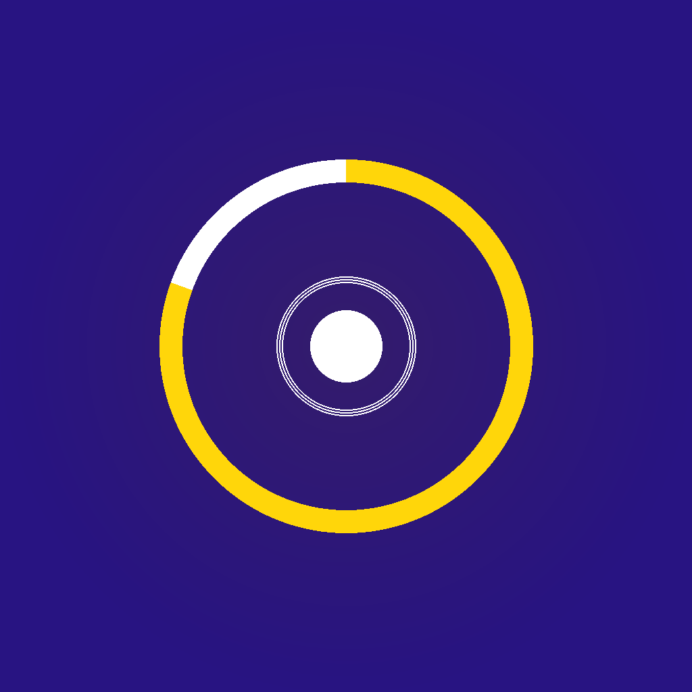

<p align="center">
  
</p>

# Orbit

A macOS menu bar app (and CLI) that connects to Google Calendar, controls Elgato lights, and alerts you before meetings. The menu bar **orbit ring** counts down in the last hour — yellow for work, red for personal, or any color per calendar.

Cross-platform CLI: works on **macOS**, **Windows**, and **Linux**.

## Features

- 🗓️ Connects to Google Calendar API
- 💡 Controls Elgato Key Light/Light Strip
- ⏰ Smart notification timing:
  - 1 blink at 5 minutes before meeting
  - 2 blinks at 1 minute before meeting
  - 5 blinks when meeting starts
- 🔄 Automatically checks for meeting updates every minute
- 🎨 Per-calendar orbit colors in the menu bar and floating HUD
- 🔔 Plays ding sound notification with light blinking
- 📱 Optional phone push via Home Assistant when away from the Mac

## Prerequisites

1. **Google Calendar API Setup**:
   - Go to [Google Cloud Console](https://console.cloud.google.com/)
   - Create a new project or select existing one
   - Enable the Google Calendar API
   - Create credentials (OAuth 2.0 Client ID)
   - Add `http://localhost:3000/oauth2callback` as authorized redirect URI

2. **Elgato Light**:
   - Ensure your Elgato light is connected to the same network
   - Find your light's IP address (check your router or use network scanner)

## Installation

1. Clone this repository
2. Install dependencies:
   ```bash
   npm install
   ```

3. Copy the environment file and configure:
   ```bash
   cp .env.example .env
   ```

4. Edit `.env` with your configuration (see `.env.example`).

## Setup Authentication

```bash
node setup-auth.js
```

This creates `credentials.json` with your Google OAuth tokens.

## Usage

### CLI / terminal mode

```bash
npm start
```

### macOS menu bar app

```bash
npm run tray
```

Build and install:

```bash
npm run dist:mac-dir
cp -R "dist/mac-arm64/Orbit.app" /Applications/
open -a Orbit
```

The menu bar app:

- Shows a colored **orbit** icon — ring depletes in the last hour before a meeting
- Dock icon with countdown badge + optional floating HUD pill
- Right-click Dock or HUD for the full menu
- Works on Apple Silicon and Intel Macs

#### Config locations

Development (`npm run tray`): `.env` and `credentials.json` in the project folder.

Bundled app:

```
~/Library/Application Support/com.rjtuit.orbit/
  ├── .env
  ├── credentials.json
  ├── calendars.json
  ├── settings.json
  └── events-log.json
```

On first launch, Orbit copies any missing files from the legacy `meeting-notifier` folder. (Electron cache lives separately in `…/orbit/`.)

## Phone push via Home Assistant

1. Add `HA_URL`, `HA_TOKEN`, and `HA_NOTIFY_TARGET` to `.env`
2. Enable **Push to phone when away** in the Orbit menu
3. On Android, enable **Override Do Not Disturb** for the **Orbit Reminders** notification channel

**Dismiss from phone:** See `ha/orbit-dismiss.yaml` — helper `input_boolean.orbit_dismiss`, action `ORBIT_DISMISS`.

**Per-calendar:** In `calendars.json`, set `"color": "yellow"` or `"color": "red"`. See `calendars.example.json`.

**Test:**

```bash
npm run test-push
```

## License

MIT
